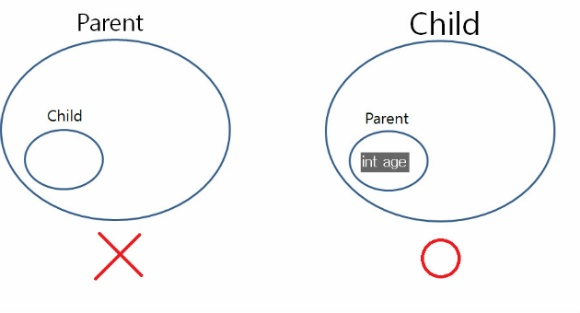

# 7장
## 1. 상속(inheritance)
### 1.1 상속의 정의
기존 클래스를 재사용하여 새로운 클래스를 작성하는 것.

> 장점
> 1) 보다 적은 양의 코드로 새로운 클래스 작성 가능
> 2) 코드를 공통적으로 관리 가능. (코드의 추가 및 변경이 매우 용이함)
> ∴ 코드의 재사용성을 높이고 코드의 중복을 제거해 
> 프로그램의 생산성과 유지보수에 크게 기여함

### 1.2 자바에서 상속 구현하기
새로 작성하고자 하는 클래스의 이름뒤에 키워드 'extends'와 상속받고자 하는 클래스의 이름을 써주면 된다.

> class Child extends Parent{
> ...
> }

자식클래스인 Child 클래스에 새로운 코드가 추가되어도 부모클래스인 Parent클래스에는 아무 영향을 주지 않는다.

상속받는다는 것 = 조상클래스를 확장(extend) 하는 것

> 주의할 점
> - 멤버만 상속가능 하다. 생성자와 초기화 블럭은 상속되지 않음.
> - 자식클래스의 멤버 개수는 조상클래스보다 항상 같거나 많음.
> - 다중상속 불가능

### 1.3 단일상속
자바에서는 상속에서 하나의 조상클래스만 가질 수 있기 때문에 클래스간의 관계가 보다 명확해지고
코드의 신뢰성이 높아진다는 장점이 있다.
(다중상속은 클래스간의 관계 에 모호성을 줌)

### 1.4 상속이외의 클래스를 재사용하는 방법 - 포함관계 
구현 방법
클래스를 작성할 때 다른 클래스를 멤버변수로 정의하여 포함시킴.

<pre><code>
 class Car{ 
 	Engine e= new Engine();
 	Door [] d = new Door[4];
 } 
</code></pre>

### 1.5 클래스간의 관계 설정
상속이 나은지 포함이 나은지
클래스 간의 관계가 (is-a)인지, (has-a)인지 분석할 필요가 있다.

* is-a : 상속관계 (~은 ~이다)
* has-a : 포함관계 (~은 ~을 가지고 있다.)
<pre><code>
 SportsCar is a Car  :  스포츠카는 자동차이다. (O)
 SportsCar has a Car : 스포츠카는 자동차를 가지고 있다. (X)
</pre></code>

### 1.6 Object클래스 - 모든 클래스의 조상
모든 클래스들이 자동으로 상속받는 최상위클래스.
toString(), equals()같은 모든 인스턴스가 가져야 할 기본적 메소드들이 정의되어 있음.

<pre><code>
class Tv{
...
}
</pre></code>

위와 같은 코드를 컴파일하면 컴파일러는 자동적으로 아래와 같은 코드로 컴파일 한다.

<pre><code>
class Tv extends Object{
...
}
</pre></code>

