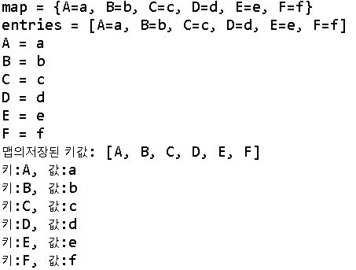

# **TreeMap**
##1.TreeMap이란

>Map은 Key-Value 형식의 데이터를 저장할 수 있는 자료구조이다.  
>중복을 허용하지 않으며 한개의 Key에 한개의 Value가 매칭된다.  
>Key는 중복 불가 , value는 중복 가능  
>특정 데이터를 찾을 때는 key를 이용해서 검색  

##2.TreeMap의 특징
>검색성능은 HashMap이 더 뛰어나지만 HashMap에선 정렬 X  
>TreeMap은 키값을 정렬해주므로 키값을 순서대로 꺼낼대 유용하다.(오름차순)  

TreeMap 의 메서드


##3.TreeMap 코드분석
```java
import java.util.Map;
import java.util.Set;
import java.util.TreeMap;

public class TreeMapEx {
	public static void main(String[] args) {
		TreeMapEx t = new TreeMapEx();
		t.checkTreeMap();
	}
	  public void checkTreeMap(){
	        TreeMap<String, String> map = new TreeMap<>();
	        map.put("C", "c"); 
	        map.put("B", "b");
	        map.put("A", "a");
	        map.put("D", "d");
	        map.put("F", "f");
	        map.put("E", "e");
	        //출력방법1
	        System.out.println("map = " + map);
	 	    Set<Map.Entry<String, String>> entries = map.entrySet();
	 	    System.out.println("entries = " + entries);  
	        
	 	    for(Map.Entry<String, String> tempEntry: entries){
	 		            System.out.println(tempEntry.getKey() +
	 		            		" = " + tempEntry.getValue());
	 		 }
 	        //출력방법2
	        System.out.println("맵의저장된 키값: "+map.keySet());
	        for(String key:map.keySet()) {
	        	System.out.println(String.format("키:%s, 값:%s", key,map.get(key)));
	        }	     
	    }
	}
```
출력결과 


